# MAD402_SPENDR_Case_Study

## Project Overview

- Concept: Spendr is a personal finanace management app.
- Monetization: Makes money by analyzing use's financial patterns and presenting them offers based on their current financial status (income through advertisement and sponsoring mostly, possible commision from marketing deals to users)
- **Target Audience:**
  -  People who have poor finance management skills
  -  those looking to improve thier finance management
  -  people looking to be more responsible with their money
  -  people who are looking to save money

## Similar Apps

- **PocketGuard**
  
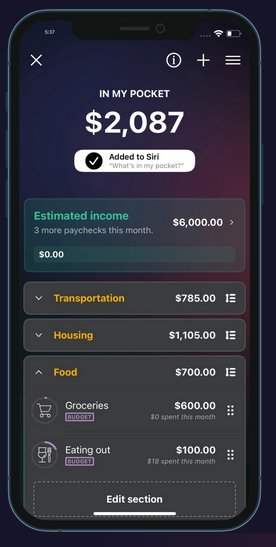 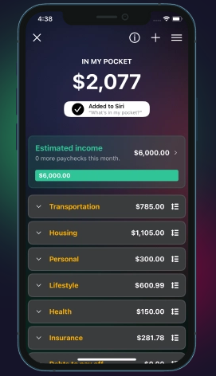 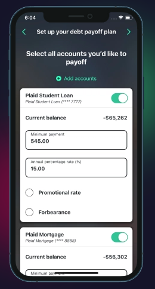 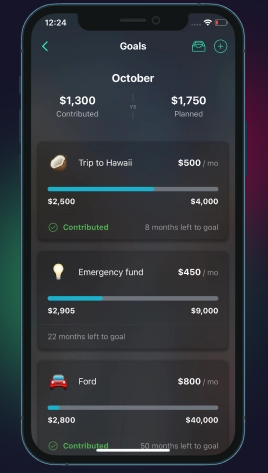

- Features
    - Total amount current money on hand displayed
    - Expected Income
    - Expense breakdown
    - Budget breakdown
    - Debt payment
    - Saving Plans
 
- Drawbacks
    - visually/aestetically inconsistent (mix of dark/light ui components)
    - lack of contrast
    - inconsistent use of color (yellow seems out of place)

- How does PocketGuard make money?
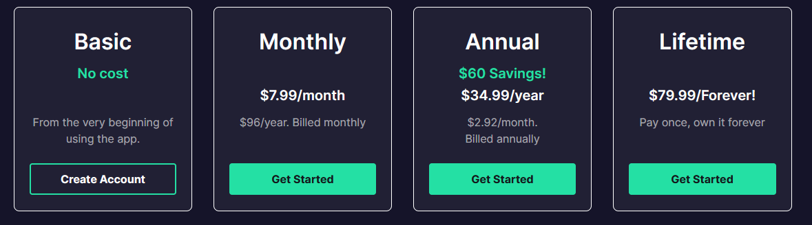 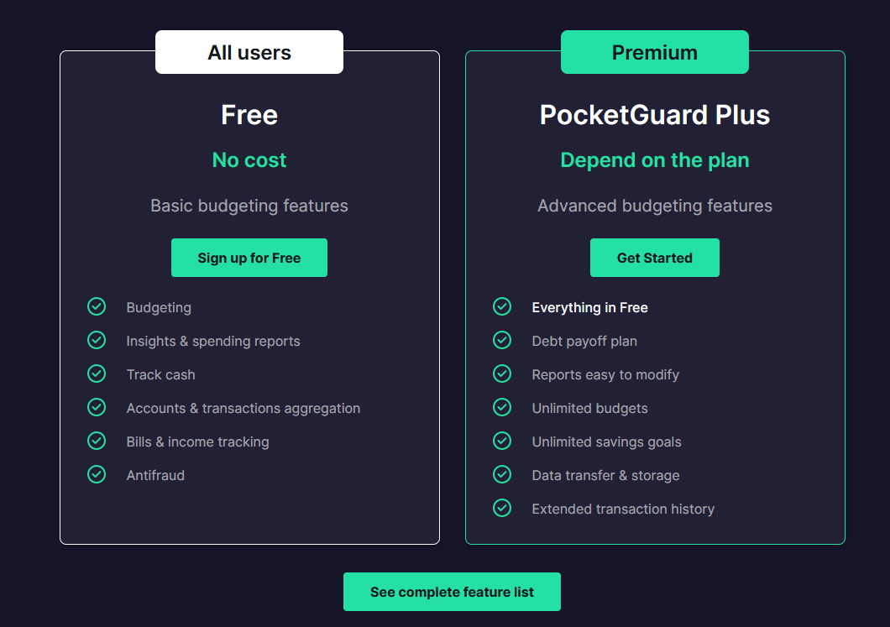
  - PocketGuard seemingly makes most of it's money through offering a premium version of the service with significant/desireable features that free users cannot access

 - **Everydollar**

   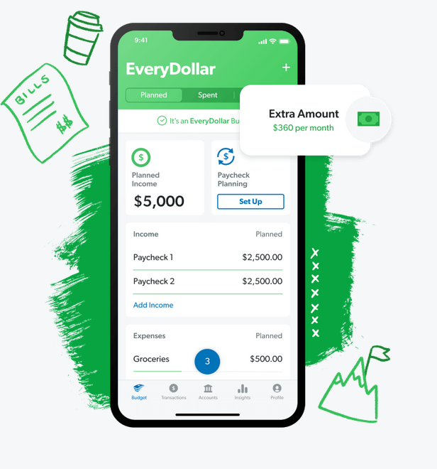  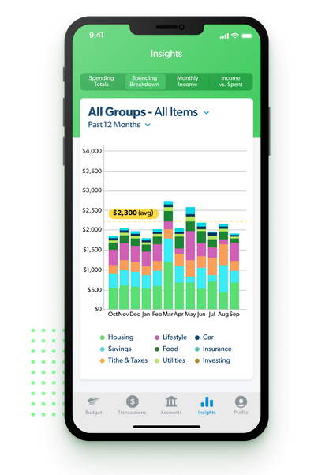  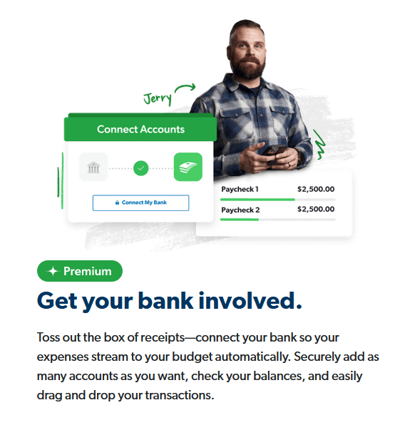    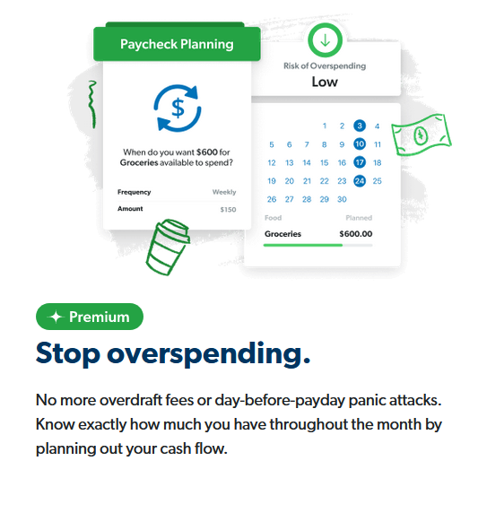    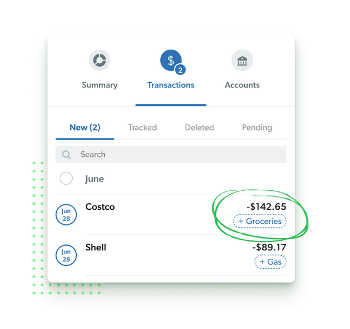

- Features
    - Expected Income (paycheck breakdown)
    - Expected/Planned Expenses
    - Tabs breaking down planned, spent and earned finances seperately
    - Budget, transactions, accounts, insights (Main Feature Pages)
    - Ability to connect bank
    - Paycheck planning, calendar breakdown
    - Saving Plans
 
- Drawbacks
    - visually very busy for mobile

- How does Everydollar make money?
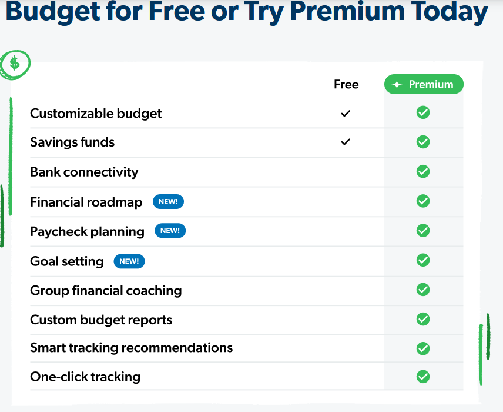 
  - Everydollar seemingly makes most of it's money through offering a premium version of the service with significant/desireable features that free users cannot access
 

- **Existing Conventions**
    - Account breakdowns
    - Expected Income and Expense planning
    - Premium plan monetization
    - Savings Plans/Goals
    - Basic Table style layout for information breakdown
 
- **Ways to Display Data**
  - Charts
  - Tables
  - Graphs
  - Pie Chart
 
  ## Conclusion
  
  - What will make this app successful:
    - Visual consistency (focus on brand identity, colors)
    - Display data in more visually apealling ways (lean in to graphs and charts stray away from basic table layouts)
    - Offer similar useful features to competitors
    - Offering users the ability to save through the app by analyzing their data and presenting them offers
      
  - Obstacles:
    - offering a feature rich app without sacrificing UI simplicity
   
  - Areas of focus
    - Income/Expense planning
    - Breaking down information in a more visual way (charts and graphs instead of just tables with numbers)
    - UI Simplicity    
